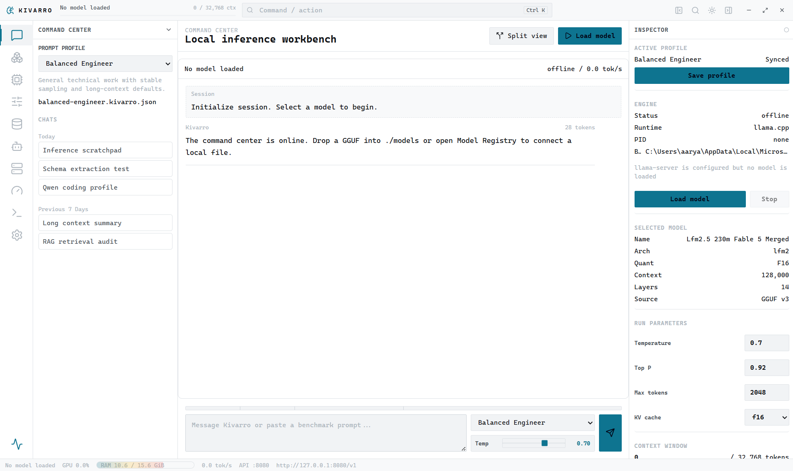

# Kivarro

[](https://github.com/AKMessi/kivarro/actions/workflows/ci.yml)
[](https://github.com/AKMessi/kivarro/actions/workflows/release.yml)
[](LICENSE)

Kivarro is a Rust/Tauri desktop workstation for private local model inference. It gives you one place to register local models, load them through a supervised inference backend, tune runtime profiles, stream chat completions, inspect hardware fit, expose a local OpenAI-compatible API, run benchmarks, test local retrieval, and keep an audit trail of model activity.

It is built for people who want local AI to feel like serious desktop software: dense controls, visible runtime state, inspectable profiles, reproducible settings, and no cloud dependency for inference.

Kivarro is source-available for non-commercial use under the [PolyForm Noncommercial License 1.0.0](LICENSE). This is not an OSI open-source license because commercial use is restricted. For commercial use, contact the repository owner.



## Contents

- [Install](#install)
- [First Run](#first-run)
- [Core Workflow](#core-workflow)
- [Model Registry](#model-registry)
- [Inference Profiles](#inference-profiles)
- [Expert Tuning](#expert-tuning)
- [Hardware Fit](#hardware-fit)
- [Command Center](#command-center)
- [Local API](#local-api)
- [RAG Knowledge Bases](#rag-knowledge-bases)
- [Benchmarks](#benchmarks)
- [Logs and Settings](#logs-and-settings)
- [Troubleshooting](#troubleshooting)
- [Development](#development)
- [Release Process](#release-process)
- [Security and Privacy](#security-and-privacy)

## Install

Download the latest alpha from [GitHub Releases](https://github.com/AKMessi/kivarro/releases).

Release builds are generated by GitHub Actions for:

| Platform | Assets |
| --- | --- |
| Windows x64 | `.exe`, `.msi` |
| Windows ARM64 | `.exe`, `.msi` |
| macOS Apple Silicon | `.dmg`, `.app.tar.gz` |
| macOS Intel | `.dmg`, `.app.tar.gz` |
| Linux x64 | `.AppImage`, `.deb`, `.rpm` |
| Linux ARM64 | `.AppImage`, `.deb`, `.rpm` |

The current alpha builds are unsigned. Windows SmartScreen and macOS Gatekeeper may warn on first launch.

## First Run

Kivarro does not ship model weights or inference binaries. Bring your own local model and backend.

1. Install Kivarro from the release asset for your platform.
2. Install an inference backend:
   - `llama.cpp` with `llama-server`
   - or `mistral.rs` with `mistralrs`
3. Put the backend binary on `PATH`, or set the environment variable shown below.
4. Put a model file in the project `models` directory, or import a file from Model Registry.
5. Open Kivarro, choose the model, choose a profile, press `Load model`, then send a prompt.

### Backend Paths

Windows PowerShell:

```powershell
$env:KIVARRO_LLAMA_SERVER = "C:\path\to\llama-server.exe"
$env:KIVARRO_MISTRALRS = "C:\path\to\mistralrs.exe"
$env:KIVARRO_API_PORT = "8080"
```

macOS/Linux:

```bash
export KIVARRO_LLAMA_SERVER=/path/to/llama-server
export KIVARRO_MISTRALRS=/path/to/mistralrs
export KIVARRO_API_PORT=8080
```

`KIVARRO_API_PORT` is only the initial default when no saved API setting exists. You can later change the host and port in Local API or Settings.

## Core Workflow

The normal Kivarro loop is:

1. **Register a model** in Model Registry.
2. **Check fit** in Hardware Fit or the Inspector before loading.
3. **Choose a profile** such as Balanced Engineer or Strict JSON Extractor.
4. **Tune runtime controls** in Expert Tuning if the model needs a different context length, backend, GPU layer split, or KV cache format.
5. **Load the model** from the Inspector, Model Registry, or Command Center.
6. **Prompt in Command Center** and watch token speed, context usage, engine state, and logs.
7. **Expose the local API** if another tool should call the same running backend.
8. **Benchmark** the loaded model when you want repeatable throughput numbers.

Use the command palette with `Ctrl+K` to jump between views and run common actions.

## Model Registry

Model Registry is the local inventory for model files.

Kivarro scans/imports:

- `.gguf`
- `.safetensors`
- `.bin`
- `.mlx`

For GGUF files, Kivarro reads the header and metadata block directly. It can show architecture, quantization, tensor count, context length, transformer block count, GGUF version, size, and fit status without loading the tensor payload into memory.

Recommended flow:

1. Place `.gguf` files in `./models`, or paste an absolute model file path into the registry import field.
2. Select a model row to make it active.
3. Check the generated load plan.
4. Press `Load` to start the selected backend with the active profile.

Model files are ignored by git. Do not commit downloaded model weights.

## Inference Profiles

Profiles are saved as `.kivarro.json` files in the app config directory. A profile contains:

- system prompt
- sampling controls
- runtime controls
- output constraints
- backend preference
- context length and memory behavior

Kivarro seeds four profiles on first launch:

| Profile | Use it for |
| --- | --- |
| Balanced Engineer | General technical work with stable defaults. |
| Strict JSON Extractor | Low-temperature extraction with JSON schema output mode. |
| Local Code Reviewer | Deterministic review of code, diffs, risks, and missing tests. |
| Long Context Analyst | Larger-context analysis with conservative sampling and compressed KV cache defaults. |

To switch profiles, use the left Command Center selector or the prompt dock selector. Kivarro prepares the engine for the selected profile before sending the next prompt. If a profile change affects launch-time settings, Kivarro restarts or prepares the backend instead of silently sending the request to the wrong runtime.

Save profile changes from the Inspector or Expert Tuning with `Save profile`.

## Expert Tuning

Expert Tuning exposes the controls that matter for local inference.

Sampling controls:

- temperature
- top-p
- top-k
- min-p
- typical-p
- repeat penalty
- repeat last N
- presence penalty
- frequency penalty
- Mirostat mode, tau, and eta
- seed
- max tokens
- stop sequences

Runtime controls:

- backend: `llama.cpp` or `mistral.rs`
- context length
- batch size
- micro-batch size
- CPU threads
- GPU offload layers
- tensor split
- main GPU
- mmap
- mlock
- Flash Attention
- KV cache quantization: `f16`, `q8_0`, `q4_0`, `f32`
- RoPE frequency base and scale

Output controls:

- plain text mode
- JSON schema mode
- grammar field
- logit bias entries
- logprobs and top logprobs

Practical tuning rules:

- If the model fails to load, lower context length first.
- If RAM pressure is high, use `q4_0` or `q8_0` KV cache and reduce context length.
- If generation is slow on CPU, reduce context length, reduce batch size, or use fewer GPU layers only if GPU offload is hurting memory pressure.
- If output must be machine-readable, start from Strict JSON Extractor and keep temperature low.
- If you need repeatability, set a seed and keep temperature/top-p conservative.

## Hardware Fit

Hardware Fit shows CPU, RAM, GPU inventory, and a model load simulation.

Kivarro uses:

- `nvidia-smi` for live NVIDIA GPU utilization and VRAM telemetry when available
- Windows WMI/CIM fallback for GPU inventory
- macOS `system_profiler` fallback for GPU inventory
- Linux `lspci` fallback for GPU inventory

The load plan estimates:

- model weight memory
- KV cache memory
- runtime overhead
- total required memory
- available RAM
- GPU layer split
- CPU layer split
- fit recommendation

Use this before loading large models. It is especially useful when comparing context lengths and KV cache formats.

## Command Center

Command Center is the main chat and runtime cockpit.

It shows:

- active model
- active profile
- engine state
- token speed
- context usage
- prompt dock
- streaming output
- stop generation control
- split view toggle
- left context panel
- right inspector

Prompt behavior:

- Kivarro sends chat completions to the supervised backend with `stream: true`.
- Rust reads the server-sent event stream and forwards token deltas to the UI.
- Press the send button while generation is active to cancel the stream.
- If the backend is not ready, Kivarro starts or prepares it before sending.

## Local API

The Local API view exposes the running backend through an OpenAI-compatible local base URL.

Default base URL:

```text
http://127.0.0.1:8080/v1
```

Kivarro intentionally limits the host to `localhost` or loopback addresses such as `127.0.0.1` and `::1`. It does not bind supervised model servers to LAN-facing addresses.

Example:

```bash
curl http://127.0.0.1:8080/v1/chat/completions \
  -H "Content-Type: application/json" \
  -d '{
    "model": "local-model",
    "messages": [{ "role": "user", "content": "Say hello from the local model." }],
    "stream": true
  }'
```

To change the API host or port:

1. Stop the running model.
2. Open Local API or Settings.
3. Set the host and port.
4. Save endpoint.
5. Load the model again.

## RAG Knowledge Bases

Kivarro includes a local retrieval workbench for inspecting and testing documents before wiring them into prompts.

You can:

- create knowledge bases
- import local `.txt`, `.md`, and source files by absolute path
- inspect generated chunks
- run retrieval test queries
- view top ranked chunks and scores

Current alpha behavior:

- documents are stored as metadata and deterministic text chunks in the app config directory
- chunks target about 1,200 characters with about 160 characters of overlap
- retrieval uses a local lexical ranker for transparent testing
- retrieval results are visible in the Knowledge Base view

The current chat flow does not automatically inject retrieved chunks into every prompt. Use the RAG workbench to inspect and validate retrieval quality, then paste selected context into Command Center when needed.

## Benchmarks

Benchmarks run against the currently loaded model and active runtime profile. Kivarro normalizes benchmark sampling to produce repeatable tokens/sec measurements.

Results include:

- model
- backend
- generated evaluation tokens
- evaluation duration
- tokens/sec
- load duration

Use Benchmarks after changing:

- backend
- GPU layers
- context length
- KV cache quantization
- batch or micro-batch size
- CPU thread count

## Logs and Settings

System Logs persist important events:

- profile saves
- model imports
- engine lifecycle changes
- API endpoint changes
- benchmark runs
- knowledge-base updates
- errors from local commands

Settings lets you manage:

- default profile
- default backend
- appearance mode
- collapsed panels
- storage path references
- API host and port

## Troubleshooting

### No models found

Put model files in `./models`, or import an absolute file path from Model Registry. Confirm the extension is one of `.gguf`, `.safetensors`, `.bin`, or `.mlx`.

### `llama-server` or `mistralrs` is not found

Put the binary on `PATH`, or set `KIVARRO_LLAMA_SERVER` / `KIVARRO_MISTRALRS` before launching Kivarro.

### Model loading gets stuck or exits

Check the Inspector and System Logs. Common fixes:

- lower context length
- lower max tokens
- use a lighter KV cache format
- reduce GPU layers
- switch to Balanced Engineer
- make sure the selected backend supports the selected model format

### Strict JSON or another profile fails after switching

Profiles can change launch-time runtime settings. If the backend needs a restart, Kivarro prepares the engine before sending. Wait for `Ready`, then send the prompt again. If the backend exits repeatedly, lower context/max tokens or use Balanced Engineer as a baseline.

### API endpoint cannot be changed

Stop the running model first. Kivarro locks endpoint changes while the backend is active so the UI and server do not disagree about the base URL.

### Windows SmartScreen or macOS Gatekeeper warns

The alpha builds are unsigned. Download only from the official GitHub Releases page for this repository.

## Development

Prerequisites:

- Node.js 20 or newer
- Rust stable
- Tauri v2 system prerequisites for your operating system
- `llama-server` or `mistralrs` for real local inference

Install dependencies:

```bash
npm install
```

Run the desktop app:

```bash
npm run tauri dev
```

Run the browser-only UI preview:

```bash
npm run dev -- --host 127.0.0.1 --port 4173
```

Run the full local verification suite:

```bash
npm run check:all
npm run test:ui
npm run tauri build
```

`npm run check:all` runs Svelte checks, production build, Rust formatting, Rust clippy with `-D warnings`, Rust check, and Rust tests.

## Repository Layout

```text
.
|-- assets/                 # README and project assets
|-- models/                 # local model library, ignored by git
|-- src/                    # SvelteKit frontend
|-- src-tauri/              # Rust/Tauri backend
|-- tests/                  # Playwright smoke tests
|-- .github/workflows/      # CI and release automation
|-- README.md
|-- CONTRIBUTING.md
|-- SECURITY.md
`-- LICENSE
```

## Release Process

The release workflow builds and uploads desktop installers when a `v*` tag is pushed.

Before tagging:

```bash
npm run check:all
npm run test:ui
npm run tauri build
```

Release checklist:

- CI is green on `main`.
- `.github/workflows/release.yml` is green for all release targets.
- GitHub Releases contains Windows x64, Windows ARM64, macOS Intel, macOS Apple Silicon, Linux x64, and Linux ARM64 assets.
- The release is marked prerelease while Kivarro is still alpha.
- No local model files, private prompts, imported documents, generated installers, logs, or `.env` files are staged.
- Package metadata, Cargo metadata, README, and license all agree on `PolyForm-Noncommercial-1.0.0`.

## Current Alpha Notes

Implemented and functional:

- model discovery/import
- GGUF metadata indexing
- profile persistence
- local engine supervision
- streamed chat completions
- prompt cancellation
- local API host/port persistence
- hardware telemetry and fit planning
- benchmarks
- knowledge-base import and retrieval testing
- logs and settings
- cross-platform release builds

Still intentionally early:

- builds are unsigned
- RAG retrieval is a workbench, not automatic prompt injection
- Agents is a draft control-plane UI, not a full autonomous agent runner
- model quality and speed depend entirely on the model file, backend, and hardware you choose

## Security and Privacy

Kivarro is designed for local-first inference. Model prompts are sent to the local backend you configure, not to a hosted Kivarro service.

Keep in mind:

- Local model files can be large and may be licensed separately by their authors.
- Imported documents may contain private data and are stored in your app config directory.
- The supervised API server is restricted to loopback hosts by design.
- Do not expose the local API to untrusted networks without adding your own gateway, authentication, and firewall rules.

Security-sensitive reports should follow [SECURITY.md](SECURITY.md).

## Contributing

Kivarro is source-available for non-commercial use under the [PolyForm Noncommercial License 1.0.0](LICENSE). Commercial use is not granted by this license.

Read [CONTRIBUTING.md](CONTRIBUTING.md) before opening a pull request. Keep changes focused, run the verification commands, and do not commit local models or generated release bundles.
